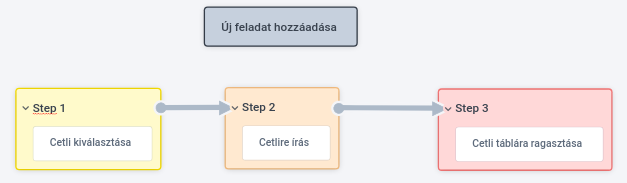
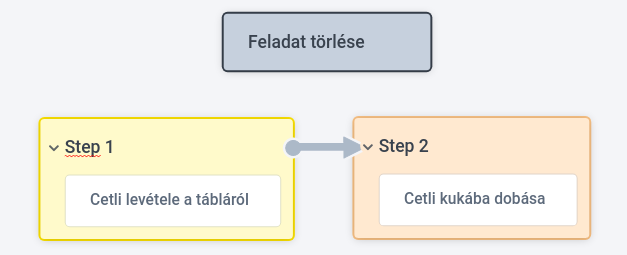
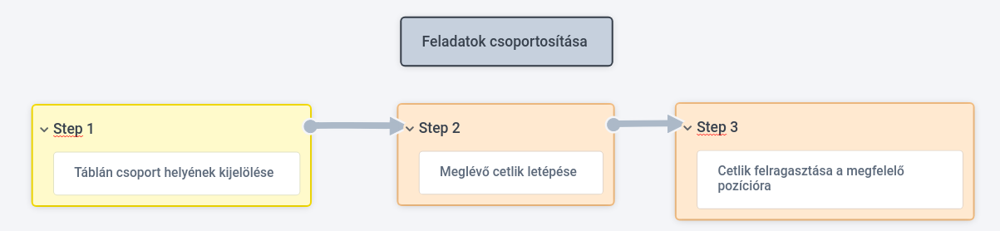
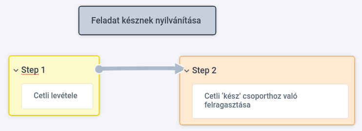

# Funkcionális specifikáció

## 3. Vágyálom rendszer

A projektünk célja egy könnyen átlátható, és kezelhető weboldal létrehozása,
amivel el szeretnénk érni azt, hogy a hétköznapi feladatainkat leegyszerűsítsük.
A weboldalunknak továbbá célja az, hogy el tudjuk adni a cetlik által nyújtott szolgáltatást.
A csapat azt álmodta meg, hogy az oldal egyszerűen szerkeszthető legyen, és ennek középpontjában az áll,
hogy felhasználóbarát is legyen egyben. A felhasználói élménynek a minősége úgy gondoljuk, hogy a weboldal 
készítésének az alapvető része, ezért a felhasználók igényeivel szeretnénk folyamatosan lépést tartani, az igényeiket
felmérni.Ahhoz, hogy a folyamatos fejlődésben ne maradjunk le, fontos az, hogy keresnünk kell fejlődési lehetőségeket
is a weboldalban. Azért szeretnénk a "cetliket" weboldalra vinni, hogy sok időt takarítsunk meg a látogatóink számára.
A weboldalnak áttekinthetőnek kell lennie, valamint a funkciók is könnyen elérhető kell hogy legyen, ez kulcsfontosságú 
ahhoz, hogy a felhasználónak az élménye jó legyen, a zavaró tényezőket ki kell zárni. A mai világban már elvárható az,
hogy minden háztartásban legyen internet-hozzáférés, aminek a segítségével könnyen lehet weboldalakat elérni. A legtöbb 
embernek már mobil internet hozzáférés is újabb lehetőséget nyújt a tartalomfogyasztásra. A célunk így tehát az, hogy 
a weboldal amit megalkotunk online is kezelhető legyen, ezáltal ez kényelmesebbé teszi az átlagos ember mindennapjait. Manapság
már könnyen el tudjuk érni a weboldalakat a telefonról vagy a tabletről, a munkahelyi laptopról vagy esetleg a PC-ről, ami 
megkönnyíti az életünket, és elérhetjük a weboldalt a nap bármelyik pillanatában.A cél egy jó weblap létrehozása amivel
felhasználókat be szeretnénk vonzani, valamint a meglévőket megtartani.
Biztosítanunk kell azt, hogy ne legyen semmi olyan, ami akadályozná a felhasználót a weboldalt tartalmának könnyű 
elérésében. Ebben a szemléletben a design kiemelkedően fontos hiszen a vizuális elemeket le kell egyszerűsíteni, és egy olyan
weboldalt kell kialakítani, ami segíti a tartalom kiemelkedését.
Amint már említettem kiemelt fontosságú a csapat számára az, hogy az oldal felhasználóbarát legyen, ezért az első benyomás 
nagyon fontos, hisz akár a mindennapokban, ott sem elengedhetetlen az, hogy ha például bemutatnak minket valakinek, számít a
megjelenés és a gesztus, ez ugyan úgy meghatározó szerepet tölt be a weboldalnál is.
A weboldalak designjának fontos tulajdonsága az egyszerű megjelenés. Hiszen a honlap elsődleges feladata a 
tartalom átadása, a jó design pedig ezt segíti. Befogadhatóbbá, vonzóbbá, könnyebbé teszi a tartalom megértését.
A jól felépített design nem csupán az esztétikumról, hanem a helyes tipográfia megválasztásáról, a funkcionalitásról
és az ergonómiáról is szól.
Ezért az oldalnak a megjelenése is nagyon fontos tényező ezért szeretnénk odafigyelni arra, hogy a 
megfelelő színeket, betűméretet, betűtípust alkalmazzuk. Fontos az, hogy a karakterformázások vonatkozhatnak az egész
dokumentumra, ésvonatkozhatnak az adott szövegre is attól függően, hogy hova írjuk. Szeretnénk továbbá a felületet 
különböző módokkal is "feldobni" az oldalt, mint például: a színvak mód, vagy a manapság egyre jobban elterjedt Dark/Light mód,
ugye ez egyre több alkalmazásban elterjedt például: facebook, instagram stb..
A platformfüggetlen megjelenés egy mai modern weboldal esetében nem extra funkció, hanem már-már követelmény. Tény az, hogy azon felhasználók
száma folyamatosan növekszik, akik okostelefonról, tabletről, vagy más mobil eszközről interneteznek, a hagyományos asztali gépek mellett (PC).
Így egyre inkább elengedhetetlenné válik, hogy a weboldal alkalmazkodjon ezekhez a felületekhez, hogy a felhasználók 
ugyanazt a honlapot, ugyanolyan minőségben élvezhessék más-más eszköz esetén is. Ezért elvárt a böngésző-függetlenség is, tehát az,
hogy minél több böngészőn elérhető legyen az oldal mint például a Google Chrome, Mozzila, Opera, Safari, Microsoft Edge és stb..
Manapság már gyakorlatilag minden harmadik ember okostelefonnal a zsebében rohangál, ezért foglalkoznunk kell a reszponzív designal is.
Fontos a reszponzív design, mert szebbek a képek, és kényelmesebb a weboldal használata,
így csökken a visszafordulási arány, tehát kevesebben hagyják el azonnal a weboldalt.
Szeretnénk a weboldalnál megtalálni a mérleg egyensúlyi pontját a használhatóság, felhasználói élmény és a kreativitás között.
A felhasználó célja az, hogy minél gyorsabban és minél egyszerűbben szeretné elvégezni azt a feladatot, vagy megtalálni az 
információt, amiért a weboldalunkra ellátoganak. Ha egy weboldal túl bonyolult, vagy ha túl nagy kreativitásnak adtunk teret
a weblanak a készítése során, akkor valószínüleg ezek a megoldások a látogatóink jelentős részét akár el is riaszthatják,
amit mi semmiképpen sem szeretnénk. Ezért fontos az, hogy ne bonyolítsunk, az oldalnak közérthetőnek kell lennie.
Egy weboldal vizuálisan megragadó, professzionális és letisztult kell legyen. Gondoljunk úgy weboldalunkra, mint cégünk,
 márkánk és szolgáltatásaink online arcára. A weboldal talán a legelső (és legfontosabb) dolog lesz, amivel egy potenciális ügyfél találkozik,
 és mint azt tudjuk, az első benyomás rendkívül fontos.
 Egy vonzó weboldal sokkal valószínűbb, hogy akcióra (vásárlás, asztalfoglalás, stb.) és folyamatosa visszatérésre készteti a látogatókat.
 Az online tér világa a folyamatosan változó felbontástól (responzív design) mely minden eszközön (számítógép, tablet, telefon)
 megfelelően mutatja weboldaladat, eleve nagy kihívás.
 Az Android színes világnak köszönhetően rengeteg féle felbontáson fogják nézni weboldaladat. 
 Milyen tehát a jó honlap? Elengedhetetlen a színhasználat: Egy igényes és elegáns színpaletta általában 2-3 főbb színből áll,
amik jól illenek egymáshoz és a cég hangulatát és jellegét is megtestesítik. Nem érdemes túlzásba vinni a színek használatát,
mert elvonhatja a figyelmet a főbb tartalomról, ami általában a szöveg.
Fontos még a könnyedén olvasható szöveg: A legegyszerűbben olvasható kombináció általában a fehér alapon fekete szöveg,
de más színvariációk is működhetnek, egy bizonyos kontraszt-tartományon belül. Ügyeljünk rá,
hogy az oldalon használt betűkészletek jól látható karaktereket tartalmazzanak és hogy a legtöbb modern
rendszer képes legyen megfelelően megjeleníteni azokat. Javasolt 10-es vagy 12-es méretű betűket használni a törzsszöveghez.
Fontos továbbá a beszédes grafikai elemek: A grafikák azért fontosak, mert kiegészíthetik az oldal egyébként száraz tartalmát.
Segítségükkel érdekesebbé tehetjük a szöveget, azonban ezeket is érdemes csak mértékkel használni.
Az egyik legfontosabb az egyszerűség: Törekedjünk az egyszerűségre az oldal designját illetően.
Hagyjunk elegendő tiszta, üres részt a szöveg körül, hogy az olvasók figyelmét a lényegre fókuszálhassuk.
Nem érdemes különböző látványos hatásokkal összezavarni a látogatókat.
Egy látványos oldal nem sokáig tartja majd meg az olvasók figyelmét, ha tartalmilag semmi értékeset nem kínál.
A látogatók gyakran egy fontos döntés előtt állnak az oldal böngészése közben,
ezért érdemes releváns és informatív tartalmakat megjeleníteni azon.
Az oldal tartalmának megfelelő használatával megerősíthetjük a leendő látogatók bizalmát is.
Terjedelem és rendezettség: A törzsszöveget (főleg hosszabb tartalmak esetén) mindig válasszuk rövidebb bekezdésekre,
 amelyeket a tartalmukra utaló beszédes, rövid alcímekkel lássunk el. Az ömlesztett szövegfalak untatni kezdik az olvasókat,
 akiknek a megnyerésére viszonylag kevés időnk van.
 Fontos az oldalon a helyesírás: Weboldalunk tartalma könnyedén felkapottá válhat, ezért fontos a
 megfelelő nyelvhasználat és helyesírás. Sosem tudhatjuk, hogy ki fog majd idézni tőlünk és nem vetne ránk,
mint cégre jó fényt, ha például hibás adatokat közölnénk oldalunkon, és így hibás forrássá válnánk.
A Google jelmondata - A kész jobb, mint a tökéletes! – persze manapság sikeres irányvonalnak tűnik,
ezért egy pár elütés még a legjobb oldalakon is előfordulhat, sajnos becsúszhat bármelyik oldalon. Ezt úgy tudjuk kiküszöbölni, hogy 
a Word helyesírás ellenőrzőjén futassuk le az oldalon megjelenített szöveget. Kellemetlen az,
ha helyesírási hibáktól hemzseg az oldalunk. 
A weboldal minden részének gyorsan és megfelelően kell működnie. A hibás vagy igénytelenül felépített szerkezetű oldal
 könnyedén kiábrándíthatja a látogatókat – ne feledjük, az oldalunk az első benyomás!
Figyeljünk oda rá, hogy a funkciók, és minden más interaktív funkció is tökéletesen működjön.
Figyeljünk a minimális görgetésre: Ez különösen a kezdőlapon fontos. A kezdőlap, vagy főoldal a tartalma legtetején tartalmazza
a legfontosabb hivatkozásokat, hogy a felhasználó rögtön láthassa azokat. Ez szintén jó pont a keresőmotoroknál is!
Felejtsük el a vég nélkül lefele gördítehtő weboldalakat! 
Egységesített kialakítás: Figyeljünk rá, hogy weboldalunk különböző aloldalai hasonlóan viselkedjenek és hasonlóan is nézzenek ki.
 A design és elrendezés maradjon változatlan minden oldalon, és csak különleges esetekben hozzunk létre egyedi oldalakat.
A tipográfiára is oda kell figyelnünk, hogy a megfelelő betűtípust és betűméretet válasszuk ki. A színsémákra is oda kell figyelnünk,
a használhatóság során, hogy a szövegek legyenek jól olvashatóak és kontrasztosak. Szeretnénk a felhasználóinkat gombokkal is vezetni, 
ezzel még egyszerűbbé tenni az oldal használhatóságát.
A cél tehát az, hogy tudjuk megmutatni azt, hogy mit kínálunk az embereknek, 
és a cetlik által okozott kellemetlenségekre tudjunk egy olyan megoldást nyújtani, ami megbízható, és kényelmesen
használható is.

## 4. Jelenlegi üzleti folyamatok
 
* Új feladat hozzáadása: (írás cetlire/telefonba/füzetbe)

* Feladat törlése: (Az adott feladat lehúzása)

* Feladat módosítása: (Az adott feladatot lehúzása és a helyére új írása.)

* Feladatok csoportosítása: (A cetliket egy adott helyre csoportosítása vagy a füzetben egy adott oldalra írása)

* Feladat késznek nyilvánítása: (Az adott cetlin a feladat mögé egy pipa helyezése)

## 5. Igényelt üzleti folyamatok
- Feladat módosítása: (Feladat kiválasztása, majd új modosítótt érték megadása)
- Felhasználóbarát UI: (Dark/Light mode és Színvak mode)
- Feladatok prioritásának megadása: (Feladat kiválasztása és a fontossági sorrend eldöntése)
- Reszponzív design: (A felhasználó bármely készülékén a legoptimálisabb módon tudja megtekinteni a feladatait)
- Feladatok hozzáadása és törlése: (A felhasználó tudjon feladatokat hozzáadni és a nem kívánt feladatokat eltávolítani)

## 6. Követelménylista
* K01 Könnyen üzemeltethető rendszer. Mielőtt belekezdünk a weboldal elkészítésébe át kell tekintenünk azt, hogy milyen 
milyen módon valósítható meg az üzemeltetés. Fontos az, hogy a weboldal készítési módszer kiválasztása során hosszútávon kezdjünk
el gondolkodni, tehát nem azt kell néznünk, hogy most mire van szükségünk, hanem gondolni kell arra is, hogy 2-3 év múlva
mire lesz szükségünk, milyen honlapot szeretnénk üzemeltetni.

* K02 A weboldal felülete legyen a felhasználó számára letisztult, hiszen fontos az, hogy gördülékenyen tudja használni a 
látogató az oldalunkat. Szeretnénk, hogy az oldalt egyszerűen lehessen kezelni, egyértelművé tenni mik a lehetőségeik a felhasználóinak, 
és ezeket a folyamatokat egyszerűen megjeleníteni a weboldalon. A felhasználó célja az, hogy minél gyorsabban és minél egyszerűbben szeretné elvégezni
 azt a feladatot, vagy megtalálni az információt, amiért a weboldalunkra ellátoganak. Ha egy weboldal túl bonyolult, vagy
ha túl nagy kreativitásnak adtunk teret a weblanak a készítése során, akkor valószínüleg ezek a megoldások a látogatóink jelentős részét akár el is riaszthatják,
amit mi semmiképpen sem szeretnénk.

* K03 A reszponzív design megalkotása. A weboldal rugalmason alkalmazkodjon az adott készüléken használt böngészőhöz, ezáltal 
egy optimális megjelenést biztosít a felhasználó számára.

* K04 platformfüggetlenség. A platformfüggetlen megjelenés egy mai modern weboldal esetében nem extra funkció, hanem már-már követelmény. 
Tény az, hogy azon felhasználók száma folyamatosan növekszik, akik okostelefonról, tabletről, vagy más mobil eszközről interneteznek,
a hagyományos asztali gépek mellett (PC).
Így egyre inkább elengedhetetlenné válik, hogy a weboldal alkalmazkodjon ezekhez a felületekhez, hogy a felhasználók ugyanazt a honlapot, ugyanolyan minőségben
élvezhessék más-más eszköz esetén is.

* K05 Böngésző-függetlenség. A weboldalunknál elvárt a böngésző-függetlenség, hiszen manapság már számos lehetőségeik vannak a felhasználóknak.
Van olyan felhasználó aki egyik böngészőt jobban preferálja a másiknál, ezért számunkra fontos az, hogy valamennyi böngészőn megjeleníthető 
legyen a weboldal ilyenek például: Google Chrome, Mozzila, Safari, Opera, Microsoft Edge és stb..

* K06 Prioritás biztosítása a felhasználó számára. A mindennapokban is előfordul, hogy egy nap több teendőnk is van, és van olyan köztük, 
ami elsőbbséget élvez, ami fontosabb mint a többi. Ezt a lehetőséget szeretnénk a cetliknél is a felhasználóknak átadni, hisz fontos az, hogy 
kényelmesebbé tegyük a weboldal használatát ezzel a lehetőséggel.

## 9. Képernyőtervek

- Legyen teljes , a felhasználó a felhasználói felületen keresztül a program minden funkciója elérhető legyen.
- A felhasználói felület legyen szellős és átlátható, jól különüljenek el egymástól az egyes funkciók, funkció csoportok.
- A felületnek olyan kifejezéseket kell használnia, amelyek megfelelnek a rendszert legtöbbet használók tapasztalatainak.
- A felületnek konzisztensnek kell lennie, azaz lehetőség szerint hasonló műveleteket hasonló módon kell realizálnia.
- Legyen visszaállíható , a felületnek rendelkeznie kell olyan mechanizmusokkal , amelyek lehetővé teszik a felhasználók számára a hiba után történő visszaállítást.
- A felületnek megfelelő interakciós lehetőségekkel kell rendelkeznie a rendszer különféle felhasználói számára.

## 10. Forgatókönyvek
Móka Mikinek a minden napok során egyre több és több feladata lett. Feladatait észben tartani már nem bírta. Ennek orvoslására sok mindent számításba vett és legjobb lehetőségnek azt tartotta, hogy feladatait cetlikre felírva tartsa.
De a cetlire felírás nem volt hatékony, mert a cetlik hamar beteltek, drágák voltak, sok szemét keletkezett. Ráadásul a cetliket mindig magával kellett cipelnie, ami nehéz volt és sok helyet foglalt. 
Ekkor váltott át füzetre, amiben már könnyebben tudta vezetni a feladatait, de ez se volt a legoptimálisabb. Ekkor barátja Béka Réka mutatott neki egy weboldalt, ahol bármilyen eszközön saját szájíze szerint rendezheti a feladatait. 
Bármikor hozzáadhat, módosíthat, törölhet. Nincs több cetlizés vagy nehéz cipekedés, mostmár az összes feladata elfér akár a zsebében. Védje a fákat, használjon webalkalmazást!

## 11. Fogalomszótár:

* UI: Felhasználói felület (User Interface). A felhasználó számára megjelenített felület, amivel interakcióba lép.

* Reszponzív design: Az oldal bármilyen eszközről megtekintve olvashatóan jelenik meg, nem marad le semmi az oldalról. (Mobil, Tablet, Desktop)

* Konzisztens: Ellentmondásoktól mentes, egységes.
