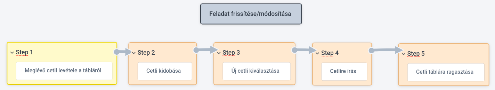

# Funkcionális specifikáció

## 1. A rendszer céljai és nem céljai

### 1.1 A rendszer céljai

Az elkészített rendszerrel a felhasználó képes lesz:

* feladatait egy helyen, átláthatóan nyomonkövetni, felesleges szemét *(cetlik)* generálása nélkül
* új feladatokat hozzáadni, módosítani a már létrehozottakat
* csoportosítani a feladatokat
* megadni a feladatok fontosságát *(prioritás)*
* törölni, ha esetleg rosszul adott meg valamit, vagy késznek nyilvánítani a feladatokat
* határidő megadása *(deadline)*
* feladatok listázása *(összes vagy egy adott csoport)*
* feldatok rendezése (prioritás, utolsó módosítás, stb.)
* az elkészített feladatok listájának lekérdezésére
* különböző feladat táblák létrehozása(amiben szintén külön csoportok feladatok vannak)
* megváltoztatni az oldal témáját *(dark/light/colorblind)*
* a fentebb felsoroltakat akármilyen internethasználatra alkalmas eszközön végrehajtani

### 1.2 A rendszer ***NEM*** céljai

Az elkészített rendszerrel a felhasználó ***NEM*** lesz képes:

* több felhasználó adatait külön-külön kezelni(böngészőnként tároljuk az adatokat)
* megtekinteni, hogy milyen akciókat hajtott végre az oldalon belül *(log)*
* széleskörűen testreszabni a rendszert *(értsd: csak light/dark/colorblind téma)*
* egyszerre több csoportba is elhelyezni egy feladatot
* ugyan azon adaokat elérni különböző eszközökről(első pont miatt)

## 2. Jelenlegi helyzet

Feladataimat rendezetlenül tartom számon, hol egy-egy cetlire írom fel, hol a telefonomba, vagy egyszerűen csak próbálom fejben tartani.
Ez a helyzet nem a legoptimálisabb, hiszen több különböző helyen 'tárolom' teendőim éppen rövidebb vagy hosszabb listáját.
Az észben tartós módszer a legkevésbé hatékony, ugyanis helyette másra is koncentrálhatnám figyelmem, hasznosabb dolgokra.
Mindemellett egy feladat nagyon könnyen elfejelthető, esetleg egyes részleteire rosszul emlékezhetünk.
A füzetre vagy cetlire való felírás már egy fokkal hatékonyabb.
Itt a probléma inkább abban merül ki, hogy rengeteg papírt használok ezzel, amik ráadásul elkeveredhetnek, ha sokfelé tárolom őket.
Sok szemetet is generál ez a megoldás, főleg, ha sokszor 'módosítom' a feladatomat, betelik a cetli és írhatok egy újat, megintcsak sok szemetet generálva.
Ezt egy fokkal hatékonyabban oldotta meg az, amikor a füzetbe felírogatást elhagytam és csak cetliket használtam, egy táblára ragasztgatva.
A telefonos applikáció használata is megfelelő volt, de a piacon elérhető opciók nem feleltek meg nekem maradéktalanul.
Úgy gondolom egy weballkalmazás lenne számomra a legalkalmasabb, kombinálva a fentebbi két módszert.

## 4. Jelenlegi üzleti folyamatok
 
- Új feladat hozzáadása: (írás cetlire/telefonba/füzetbe)

- Feladat törlése: (Az adott feladat lehúzása)

- Feladat módosítása: (Az adott feladatot lehúzása és a helyére új írása.)

- Feladatok csoportosítása: (A cetliket egy adott helyre csoportosítása vagy a füzetben egy adott oldalra írása)

- Feladat késznek nyilvánítása: (Az adott cetlin a feladat mögé egy pipa helyezése)

## 5. Igényelt üzleti folyamatok
- Feladat módosítása: (Feladat kiválasztása, majd új modosítótt érték megadása)
- Felhasználóbarát UI: (Dark/Light mode és Színvak mode)
- Feladatok prioritásának megadása: (Feladat kiválasztása és a fontossági sorrend eldöntése)
- Reszponzív design: (A felhasználó bármely készülékén a legoptimálisabb módon tudja megtekinteni a feladatait)
- Feladatok hozzáadása és törlése: (A felhasználó tudjon feladatokat hozzáadni és a nem kívánt feladatokat eltávolítani)

## 9. Képernyőtervek

- Legyen teljes , a felhasználó a felhasználói felületen keresztül a program minden funkciója elérhető legyen.
- A felhasználói felület legyen szellős és átlátható, jól különüljenek el egymástól az egyes funkciók, funkció csoportok.
- A felületnek olyan kifejezéseket kell használnia, amelyek megfelelnek a rendszert legtöbbet használók tapasztalatainak.
- A felületnek konzisztensnek kell lennie, azaz lehetőség szerint hasonló műveleteket hasonló módon kell realizálnia.
- Legyen visszaállíható , a felületnek rendelkeznie kell olyan mechanizmusokkal , amelyek lehetővé teszik a felhasználók számára a hiba után történő visszaállítást.
- A felületnek megfelelő interakciós lehetőségekkel kell rendelkeznie a rendszer különféle felhasználói számára.

## 10. Forgatókönyvek
Móka Mikinek a minden napok során egyre több és több feladata lett. Feladatait észben tartani már nem bírta. Ennek orvoslására sok mindent számításba vett és legjobb lehetőségnek azt tartotta, hogy feladatait cetlikre felírva tartsa.
De a cetlire felírás nem volt hatékony, mert a cetlik hamar beteltek, drágák voltak, sok szemét keletkezett. Ráadásul a cetliket mindig magával kellett cipelnie, ami nehéz volt és sok helyet foglalt. 
Ekkor váltott át füzetre, amiben már könnyebben tudta vezetni a feladatait, de ez se volt a legoptimálisabb. Ekkor barátja Béka Réka mutatott neki egy weboldalt, ahol bármilyen eszközön saját szájíze szerint rendezheti a feladatait. 
Bármikor hozzáadhat, módosíthat, törölhet. Nincs több cetlizés vagy nehéz cipekedés, mostmár az összes feladata elfér akár a zsebében. Védje a fákat, használjon webalkalmazást!
