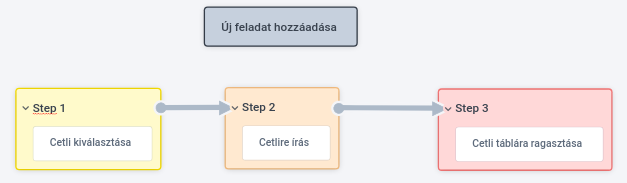
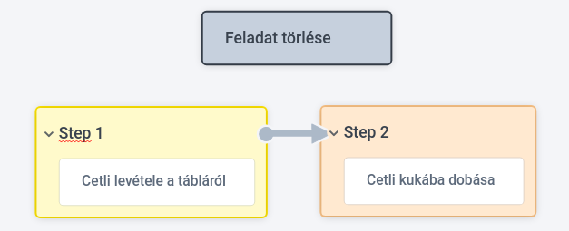
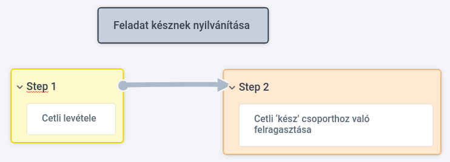

# Követelmény specifikáció

## 1. Jelenlegi helyzet

Feladataimat rendezetlenül tartom számon, hol egy-egy cetlire írom fel, hol a telefonomba, vagy egyszerűen csak próbálom fejben tartani.
Ez a helyzet nem a legoptimálisabb, hiszen több különböző helyen 'tárolom' teendőim éppen rövidebb vagy hosszabb listáját.
Az észben tartós módszer a legkevésbé hatékony, ugyanis helyette másra is koncentrálhatnám figyelmem, hasznosabb dolgokra.
Mindemellett egy feladat nagyon könnyen elfejelthető, esetleg egyes részleteire rosszul emlékezhetünk.
A füzetre vagy cetlire való felírás már egy fokkal hatékonyabb.
Itt a probléma inkább abban merül ki, hogy rengeteg papírt használok ezzel, amik ráadásul elkeveredhetnek, ha sokfelé tárolom őket.
Sok szemetet is generál ez a megoldás, főleg, ha sokszor 'módosítom' a feladatomat, betelik a cetli és írhatok egy újat, megintcsak sok szemetet generálva.
Ezt egy fokkal hatékonyabban oldotta meg az, amikor a füzetbe felírogatást elhagytam és csak cetliket használtam, egy táblára ragasztgatva.
A telefonos applikáció használata is megfelelő volt, de a piacon elérhető opciók nem feleltek meg nekem maradéktalanul.
Úgy gondolom egy weballkalmazás lenne számomra a legalkalmasabb, kombinálva a fentebbi két módszert.

## 2. Vágyálom rendszer

A projektünk célja egy könnyen átlátható, és kezelhető weboldal létrehozása,
amivel el szeretnénk érni azt, hogy a hétköznapi feladatainkat leegyszerűsítsük.
A tervünk szerint, egy egyszerűen szerkeszthető weboldalt álmodtunk meg, ami felhasználóbarát,
ezzel segítve a felület egyszerű használatát időseknek és fiataloknak egyaránt.
A mai világban már elvárható az, hogy minden háztartásban legyen internet-hozzáférés, 
sőt már a legtöbb embernek már a mobil internet is adott. A célunk így tehát az, hogy a weboldal amit megalkotunk online is kezelhető legyen, ezáltal ez kényelmesebbé teszi az átlagos ember mindennapjait, mivel,
a telefonról vagy a tabletről, a munkahelyi laptopról vagy esetleg 
PC-ről könnyedén elérhető legyen a nap bármelyik pillanatában.
A cél egy jó weblap létrehozása amivel felhasználókat be szeretnénk vonzani, valamint a meglévőket megtartani.
Kiemelt fontosságú a csapat számára az, hogy az oldal felhasználóbarát legyen, ezért az első benyomás fontos, hisz akár a mindennapokban, ott sem elengedhetetlen az, hogy ha bemutatnak minket valakinek, számít a megjelenés és a gesztus, ez meghatározó lehet a weboldalnál is. Az oldalnak a megjelenése is nagyon fontos tényező ezért szeretnénk odafigyelni arra, hogy a megfelelő színeket, betűméretet, betűtípust alkalmazzuk. Szeretnénk a felületet különböző módokkal is feldobni az oldalt, mint például: a színvak mód, vagy a manapság egyre jobban elterjedt Dark/Light mód. 
A felhasználó célja az, hogy minél gyorsabban és minél egyszerűbben szeretné elvégezni azt a feladatot, vagy megtalálni az 
információt, amiért a weboldalunkra ellátoganak. Ha egy weboldal túl bonyolult, vagy ha túl nagy kreativitásnak adtunk teret
a weblanak a készítése során, akkor valószínüleg ezek a megoldások a látogatóink jelentős részét akár el is riaszthatják,
amit mi semmiképpen sem szeretnénk. Ezért fontos az, hogy ne bonyolítsunk, az oldalnak közérthetőnek kell lennie.
Biztosítanunk kell azt, hogy ne legyen semmi olyan, ami akadályozná a felhasználót a weboldalt tartalmának könnyű 
elérésében. Ebben a szemléletben a design kiemelkedően fontos hiszen a vizuális elemeket le kell egyszerűsíteni, és egy olyan
weboldalt kell kialakítani, ami segíti a tartalom kiemelkedését.
Egy weboldal vizuálisan megragadó, professzionális és letisztult kell legyen. Gondoljunk úgy weboldalunkra, mint cégünk,
márkánk és szolgáltatásaink online arcára. A weboldal talán a legelső (és legfontosabb) dolog lesz, amivel egy potenciális ügyfél találkozik,
és mint azt tudjuk, az első benyomás rendkívül fontos.
Az online tér világa a folyamatosan változó felbontástól (responzív design) mely minden eszközön (számítógép, tablet, telefon)
megfelelően mutatja weboldaladat, eleve nagy kihívás.
 Az Android színes világnak köszönhetően rengeteg féle felbontáson fogják nézni weboldaladat. 
A platformfüggetlenség elvárt a weboldallal szemben, biztosítanunk kell azt, hogy több platformon, valamint
böngészőn is elérhető legyen mint például a Google Chrome, Mozzila, Opera, Safari, Microsoft Edge és stb...
Ma már 2020-at írunk, ahol már nem csak a PC-ről használjuk a weboldalakat, hanem elterjedtek a laptopok, 
tabletek, és az okostelefonok is egyaránt. Manapság már gyakorlatilag minden harmadik ember okostelefonnal a 
zsebében rohangál, ezért foglalkoznunk kell a reszponzív designal is.
Fontos a reszponzív design, mert szebbek a képek, és kényelmesebb a weboldal használata,
így csökken a visszafordulási arány, tehát kevesebben hagyják el azonnal a weboldalt.
Milyen tehát a jó honlap? Elengedhetetlen a színhasználat: Egy igényes és elegáns színpaletta általában 2-3 főbb színből áll,
amik jól illenek egymáshoz és a cég hangulatát és jellegét is megtestesítik. Nem érdemes túlzásba vinni a színek használatát,
mert elvonhatja a figyelmet a főbb tartalomról, ami általában a szöveg.
Fontos még a könnyedén olvasható szöveg: A legegyszerűbben olvasható kombináció általában a fehér alapon fekete szöveg,
de más színvariációk is működhetnek, egy bizonyos kontraszt-tartományon belül.
Ügyeljünk rá, hogy az oldalon használt betűkészletek jól látható karaktereket tartalmazzanak és hogy a legtöbb modern
rendszer képes legyen megfelelően megjeleníteni azokat. Javasolt 10-es vagy 12-es méretű betűket használni a törzsszöveghez.
Fontos továbbá a beszédes grafikai elemek: A grafikák azért fontosak, mert kiegészíthetik az oldal egyébként száraz tartalmát.
Segítségükkel érdekesebbé tehetjük a szöveget, azonban ezeket is érdemes csak mértékkel használni.
Az egyik legfontosabb az egyszerűség: Törekedjünk az egyszerűségre az oldal designját illetően.
Hagyjunk elegendő tiszta, üres részt a szöveg körül, hogy az olvasók figyelmét a lényegre fókuszálhassuk.
A weboldal minden részének gyorsan és megfelelően kell működnie. A hibás vagy igénytelenül felépített szerkezetű oldal
 könnyedén kiábrándíthatja a látogatókat – ne feledjük, az oldalunk az első benyomás!
Figyeljünk oda rá, hogy a funkciók, és minden más interaktív funkció is tökéletesen működjön.
Figyeljünk a minimális görgetésre: Ez különösen a kezdőlapon fontos. A kezdőlap, vagy főoldal a tartalma legtetején tartalmazza
a legfontosabb hivatkozásokat, hogy a felhasználó rögtön láthassa azokat.
A design és elrendezés maradjon változatlan minden oldalon, és csak különleges esetekben hozzunk létre egyedi oldalakat.
Fontosnak tartjuk a logikus navigációt: A menüelemeket mindig az oldal tetejére, általában az oldalhajtás fölé helyezzük el.
Egy oldal ne tartalmazzon 10-nél több menüelemet – fontos, hogy a látogatók mindent könnyedén és gyorsan megtaláljanak.
Javasolt az oldalt a legfrissebb Internet Explorer, Safari és Firefox böngészőkön is tesztelni.
A tipográfiára is oda kell figyelnünk, hogy a megfelelő betűtípust és betűméretet válasszuk ki.
Platform- és böngészőkompatibilitás: A különböző böngészőszoftverek más és más módon jeleníthetnek meg bizonyos tartalmakat.
Fontos a használhatóság az oldalunkban, de legalább annyira fontos, hogy megfogjuk a látogatóinkat a designnal,
amikor megtekintik először a weboldalt. A cél tehát az, hogy tudjuk megmutatni azt, hogy mit kínálunk az embereknek,
és a cetlik által okozott kellemetlenségekre tudjunk egy olyan megoldást nyújtani, ami megbízható,
és kényelmesen használható is.

## 3. Jelenlegi üzleti folyamatok:

* Új feladat hozzáadása: Cetli kiválasztása -> Cetlire írás -> Cetli táblára ragasztása

* Feladat törlése: Cetli levétele a tábláról -> Cetli kukába dobása

* Feladatok csoportosítása: Táblán csoport helyének kijelölése -> Meglévő cetlik letépése -> Cetlik felragasztása a megfelelő pozícióra

* Feladat késznek nyilvánítása: Cetli levétele -> Cetli ‘kész’ csoporthoz való felragasztása

* Feladat frissítése/módosítása: Meglévő cetli levétele a tábláról -> Cetli kidobása -> Új cetli kiválasztása -> Cetlire írás -> Cetli táblára ragasztása

## 4. Igényelt üzleti folyamatok

* Új feladat hozzáadása
* Feladat törlése
* Feladatok csoportosítása
* Feladat módosítása
* Feladat késznek nyilvánítása
* Felhasználóbarát UI: Sötét és világos színsémák elkészítése a kellemes felhasználói élményért + Színvak mód
* Feladatok prioritásának megadása: (Prioritizing tasks)

## 5. A rendszerre vonatkozó szabályok
- A web felület szabványos eszközökkel készüljön.
- Javascript és HTML/CSS alkalmazása.
- Reszponziv design megvalósítása.
- Dark/Light mode.

## 6. Követelménylista

* K01: -  Könnyen üzemeltethető rendszer. Mielőtt belekezdünk a weboldal elkészítésébe át kell tekintenünk azt, hogy milyen módon valósítható meg az üzemeltetés. Fontos az, hogy a weboldal készítési módszer kiválasztása során hosszú távon kezdjünk el gondolkodni, tehát nem azt kell néznünk, hogy most mire van szükségünk, hanem gondolni kell arra is, hogy 2-3 év múlva mire lesz szükségünk, milyen honlapot szeretnénk üzemeltetni.

* K02: -  A weboldal felülete legyen a felhasználó számára letisztult, hiszen fontos az, hogy gördülékenyen tudja használni a látogató az oldalunkat. Szeretnénk, hogy az oldalt egyszerűen lehessen kezelni, egyértelművé tenni mik a lehetőségeik a felhasználóinak, és ezeket a folyamatokat egyszerűen megjeleníteni a weboldalon.

* K03: -  A reszponzív design megalkotása. A weboldal rugalmason alkalmazkodjon az adott készüléken használt böngészőhöz, ezáltal egy optimális megjelenést biztosít a felhasználó számára.

* K04: -  Böngésző-függetlenség. A weboldalunknál elvárt a böngésző-függetlenség, hiszen manapság már számos lehetőségeik vannak a felhasználóknak.
Van olyan felhasználó aki egyik böngészőt jobban preferálja a másiknál, ezért számunkra fontos az, hogy valamennyi böngészőn megjeleníthető legyen a weboldal ilyenek például: Google Chrome, Mozzila, Safari, Opera, Microsoft Edge és stb..

* K05: -  Prioritás biztosítása a felhasználó számára. A mindennapokban is előfordul, hogy egy nap több teendőnk is van, és van olyan köztük, ami elsőbbséget élvez, ami fontosabb mint a többi. Ezt a lehetőséget szeretnénk a cetliknél is a felhasználóknak átadni, hisz fontos az, hogy kényelmesebbé tegyük a weboldal használatát ezzel a lehetőséggel.

* K06: -  A cetlik szerkeszthetőek legyenek. A mindennapok során előfordul, hogy egy feladat időközben módosul. 
Ekkor a felhasználónak álljon módjában az adott cetlit kedve szerint szerkeszteni.

* K07: -  A cetlik legyenek törölhetőek. Ha a mindennapok során előfordul, hogy egy feladatot mégsem kell elvégezni, ekkor a felhasználó az adott feladatot tudja törölni a listából.

* K08: -  Felhasználóbarát UI. A felhasználó számára legyen elérhető több UI amit kedve szerint tud módosítani. 
A módosítás legyen egyértelmű és átlátható. Esetünkben az alábbi 3 mód lesz elérhető : Dark mode, Light mode, Színvak mode. Ezek között az adott button megnyomásával tud váltogatni.

* K09: - Cetlik listázása kategóriák szerint. Szeretnénk még jobban átláthatóvá tenni a felhasználó számára a feladatait, ezért biztosítjuk a számára a feladatainak a kategorizálását.
A kategóriák a következőek lehetnek : kész feladatok szerint, aktuális feladatok szerint, a K05 pontban kifejtett prioritás szerint.

